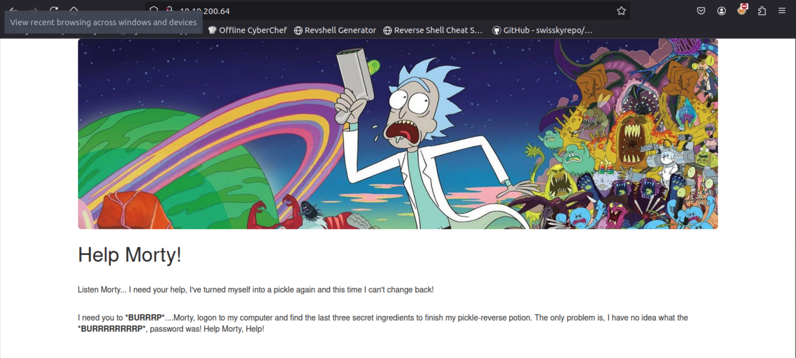
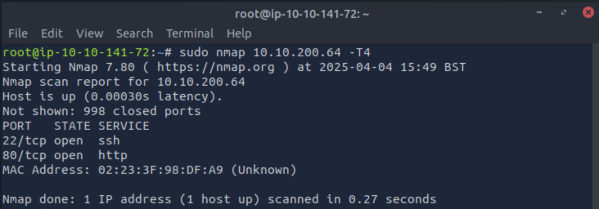
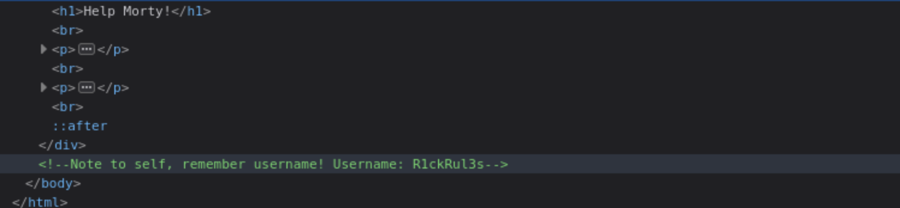
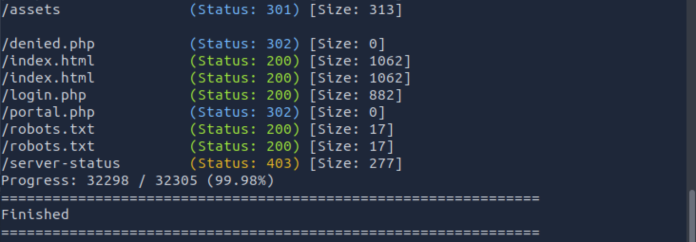
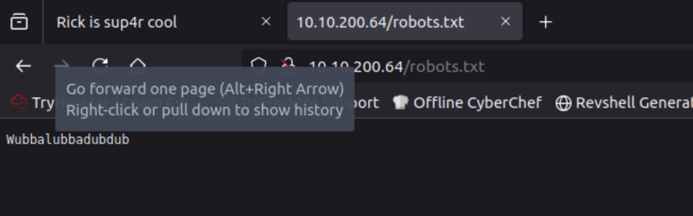
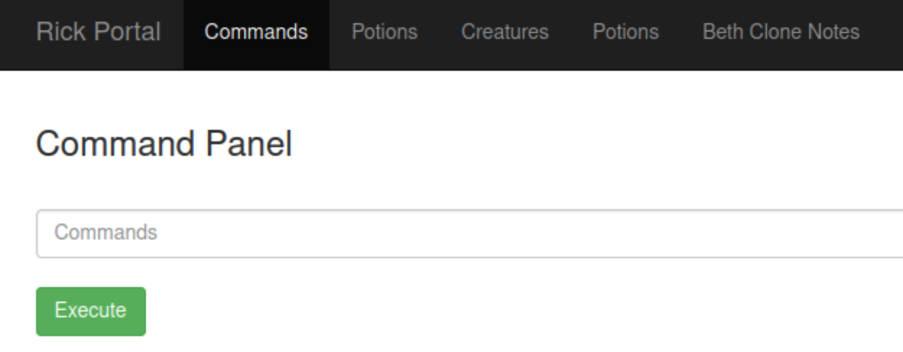

# 🥒 Pickle Rick Challenge  
**Difficulty:** Easy  

## 📝 Challenge Overview  
In this challenge, we have to exploit a web server and find **three ingredients** to help Rick make his potion and transform himself back into a human from a pickle.  
---


## 🔍 Step 1: Port Scanning  
We start by scanning the target machine for open ports using `nmap`:  
---

```bash
sudo nmap <IP_ADDR> -T4
```


✅ Findings:

Port 22 (SSH) – Might be useful later.
Port 80 (HTTP) – Let's check the website.

## 🔎 Step 2: Source Code
By examing the source code of the page, we can see that someone left a comment with a username. For sure we will save it for potential login
---



✅ Findings: 

Username - R1ckRul3s

## 🔎 Step 3: Directory Enumeration
Since the website doesn’t reveal much, we use Gobuster to enumerate directories.
---

```bash
gobuster dir -u http://<IP_ADDR> -x php,txt,json,js,css,pdf -w /usr/share/wordlists/dirb/common.txt
```


✅ Findings:

/robots.txt
/index.html
/login.php

Let's give a look to each one. So in robots directory we have just a passphrase (we will save this as a potential password). 



## 🔎 Step 4: Logging
Now we passing to login.php where is the login page and we try to login using the username = R1ckRul3s we got from the source code and the password = Wubbalubbadubdub from robots.txt
---


BOOM! We are now loged and can run commands on the remote server.
